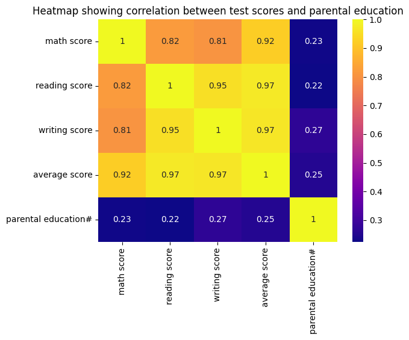
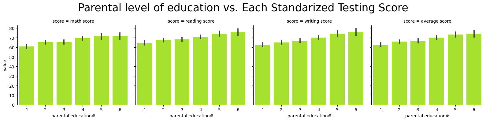
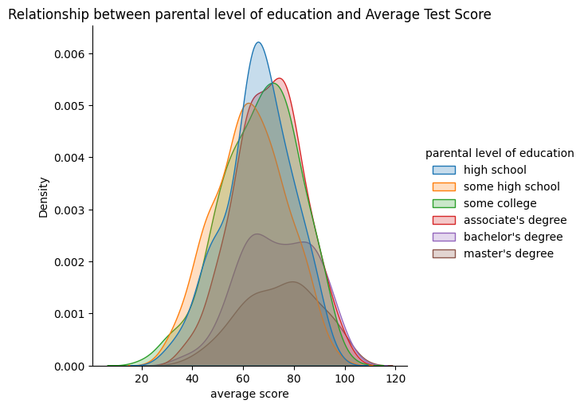

# The Socioeconomic Bias of Not-So-Standarized Testing 
**Team Members**
- Noah Stasuik (Analysis 1)
- Tina Liu (Analysis 2)
- Peter Idoko (Analysis 3) 

In this project, Noah, Peter, and Tina explored a data set called "Student Performance in Exams”. Within this project, we each explored different socioeconomic factors that impact student performance on Standardized Tests. We were interested to explore how these socioeconomic factors may affect student performance because we are university students studying at UBC, a university with many international students. Through our analysis, we hope to emphasize and acknowledge how social and financial class, gender, and race are important elements to consider when it comes to student performance. Ultimately, our findings will criticize standardized testing for not considering these socio-economic factors when it comes to student performance.
 
## Exploratory Data Analysis Highlights for Analysis 1:
In my EDA I wanted to see if there was a correlation between parental level of education, and standardized testing scores in math, reading and writing. Through some visualization, cleaning my dataset and exploring the strengths and weaknesses of my dataset I was able to find that there was indeed correlation that exists between parental level of education and students grades on standardized testing.
## Exploratory Data Analysis Highlights for Analysis 2:
Analysis 2: In my analysis, I investigated whether or not one sex perform better on standardized exams than the other. I simplified the data to only use the following columns: "gender", "writing scores","reading scores", and "math scores". With these columns, I dropped any NA values and only worked with scores in the range [0,100]. With these changes, I used barplots, violin plots, and compound plots to visualize my data. 
## Exploratory Data Analysis Highlights for Analysis 3:
For my analysis I wanted to see the correlation between overall score, race/ethnicity, and test preparation course completion. To collect the data for my analysis, I made a variable called 'total score' that summed the values of students' reading, writing, and math scores into one variable. Additionally, I dropped the columns/variables that were not pertaining to my research such as gender, parental level of education, and lunch. I then went on to create a pairplot(Fig.1), barplot(Fig.2), and a displot(Fig.3) to help visualize the dataset and reinforce my research question.
 
## How parental level of education effects student’s grades on standardized tests (Noah)
For my question I decided to explore how a parent's education level affects their child's results on standardized exams. I felt that this question was an important one to look into because it could prove if a student's parents having a formal education gives an unfair advantage. This is crucial since many schools across the world rely on testing, which we have proven to be bias towards students of different socioeconomic statuses.
 
To begin my analysis I first decided to look into whether there existed a correlation between students' grades and their parents' education level.
### Figure 1:

*The heatmap shows that there exists a strong correlation between the math, reading and writing scores, making it a viable option to use an average score in my analysis.*
After visualizing my data with a heatmap I then moved on to looking at the data through a few visualizations. After plotting my heatmap and verifying the average correlations with the individual subjects I will now show some graphs in order to prove my research question.
 
After proving this I created a visualization that separated parental level of education into 6 categories with 1: some highschool, 2: highschool, 3: some college 4: associate's degree 5: bachelor's degree and 6: master's degree.
### Figure 2:

*The barplot shows how parental level of education correlates with student’s grades on standardized tests*
This visualization was really helpful in answering my research question since it very clearly shows that when a student’s parents are more educated higher grades are then achieved. After confirming my research question with the barplot I then used a KDE plot to confirm what my first visualization showed me. 
### Figure 3:

*This KDE plot again shows that as a student’s parent’s are more educated, they perform better on standardized tests in math, reading and writing*
The KDE confirmed what my bar plot also showed, which is that the more educated a student’s parents are, the better they perform on standardized test’s. What the KDE plot showed that the barplot did not, was that there is more data on students whose parents are less educated, than students whose parents are more educated, which could affect the conclusion of my data analysis.
 
## Does one sex do better on standardized exams than the other? (Tina) + results
Before doing any analysis at all, I hypothesized that females perform better than males in standardized tests. As a female university student, I was interested to see if one sex does better on standardized tests because I have always been told that “guys are smarter than girls”. In efforts to debunk this myth and see if females do better on certain subjects, I explore my research questions through 3 visualizations. These research interests are important to explore because females often struggle with expressing their intelligence and expertise. Therefore, I hope my data analysis helps females feel more empowered. 
To start off, I check if my data analysis is valid or not by checking the number of males and females in the “gender” column. 

*By having relatively equal sample sizes for each gender, it increases statistical power and validates the data set more. I was able to move on with my data analysis since I was confident with the given data.*   
Moving on, I wanted to compare the averages of each standardized tests to each sex to see which sex does better in what subject. I also compared the total averages of each subject and compared it to each sex in the 4th graph. 

*Based on the visualization above, I found out that females do better in writing and reading, and males do better in math. When comparing the total score average of all 3 subjects, females did 2.36% better.*   
 
To understand my data set more, I decided to use a violin plot to check the distribution of each test score. 

*Based on the visualization above, more females seem to be getting scores closer to 100% in comparison to me. The only outlier would be in math. Math is the only subject where more females are getting scores less than 20%.*  
 
Overall, each of the graphs in these visualizations support my original hypothesis that females perform better on standardized tests than males. Looking at the other research interests, there are definitely other factors that contribute to each gender’s performance so it’s important to note that just because females do better on standardized tests doesn’t mean females are automatically smarter. 
 
## Do certain races complete more test preparation courses than others and as a result do they perform better? (Peter)
For my research, I was interested in knowing if certain racial/ethnic groups had a higher ratio of students who had completed test preparation courses to students who had not. In relation to that, I also wanted to find out if certain races performed better overall in standardized testing as opposed to others. Putting these together, I ultimately wanted to know if certain racial groups performed better than others and how the completion of test preparation courses had affected these scores. To explore my research question, I created the following data visualizations to help understand the information and come to a conclusion. 

 This bar plot shows the correlation between the different race/ethnicity groups and overall score. The plot shows that certain racial/ethnical groups perform above others in overall score. The difference may not be significant but it is notable.

This graph shows the relation between the different racial group and how they performed in relation to whether or not they completed test preparation courses. As can be seen, groups 4, 5, and 1 had a higher number of people who completed test prep courses per group. The graph shows how these groups had higher overall scores as a result of the amount of students who had completed test preparation courses. Similarly, even students who didn’t perform well in their respective groups but had completed test prep courses still performed better than students who didn’t do well and had not completed test prep courses.
After completing my EDA, I was able to come to the conclusion that certain races have a higher number of people who completed test preparation courses and as a result performed higher than others. I compared these results to the college board SAT results and found similar outcomes. I found that White and Asian students had a higher percentage of students who placed in the 75th percentile. This along with my research demonstrates how standardized tests are unbalanced with certain races tending to perform above others. This was important to me because as a black international student, I relied on the SAT to get me to University and although I was fortunate enough to perform well on the examination, I was disposed to not perform as highly as other students because of my race and the amount of test prep available to me. In conclusion, in the context of race, standardized tests are not standard.
 
# Conclusion 
Analysis 1: Through my Data analysis, I was able to find that there is indeed a correlation that exists between parental level of education and student’s standardized testing grades. This shows that standardized tests do indeed have a bias toward student’s who’s parents are more educated.
Analysis 2: In my data analysis, I came to the conclusion that females on average tend to perform better on standardized tests in comparison to males.  
Analysis 3: From my data analysis, I came to the conclusion that in the context of race, standardized tests are not standard as certain races tend to perform better than others.
**After comparing all of our findings, individuals that tend to do best on the SAT are female asians with parents who completed the highest level of education.** 
 
For the following conclusions listed above, we can apply them to real world data presented by the SAT Suite of Assessments Annual Report. 

Analysis 1: By observing the SAT scores from 2022 my analysis also seemed to line up with this real world example. The image above shows that student’s who’s parents have a higher level of education tend to do better on the SAT. This is the exact same finding as the one I came too through analyzing our groups dataset. One thing that is drastic from these findings is that, specifically for SAT’s a score difference of 50 can be a huge difference for students getting into a school, and the data shows that there is a difference in average score of almost 200, between student’s who’s parents did not complete highschool, and those whose parents completed a master’s degree.
Analysis 2: Looking at the mean scores of each gender in EWR, females tend to perform better by about 5% (531 vs 526 respectively). This supports my analysis because in this data set, females perform better in reading and writing in comparison to me. In math, males perform better by about 18%. This supports my findings because math is the only subject where males do better. Further analysis should be done to understand why females only perform better in reading and writing. However, looking at the total mean score of each gender, males score 13 points higher. This was interesting data to find because it opposes my conclusions from our data set. Ultimately, my juxtaposing conclusions shows the dangers in stereotyping genders.
Analysis 3: Analyzing the overall mean total score of the different races, we can see that white and asian students perform better than the other races represented. Similarly, if we look at the Score distributions by subgroup we see that White and Asian students have a higher representation in the 75th percentile and even more, Asians tend to perform highest above all. Similar to my analysis, we can see that there is an imbalance in test performance according to race.
 
After conducting individual analysis on the effects of parental level of education, gender, and race, we all came to the conclusion that there are many socio-economic factors that impact student performance on standardized tests. In fact, our findings highlight how unconventional standardized tests, and schools should not use them as a way to measure intelligence. 

[def]: images/analysis1_image2.png
